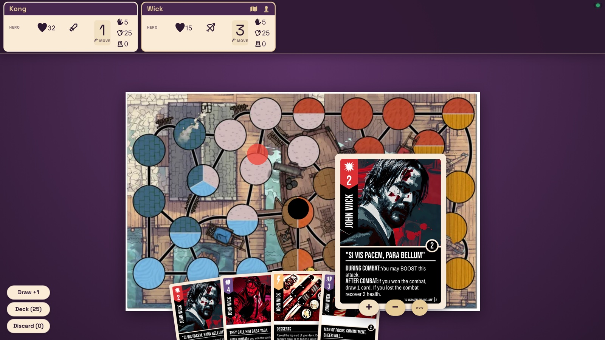
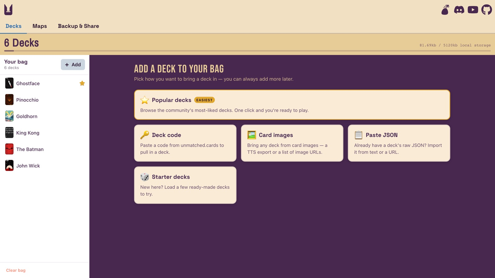
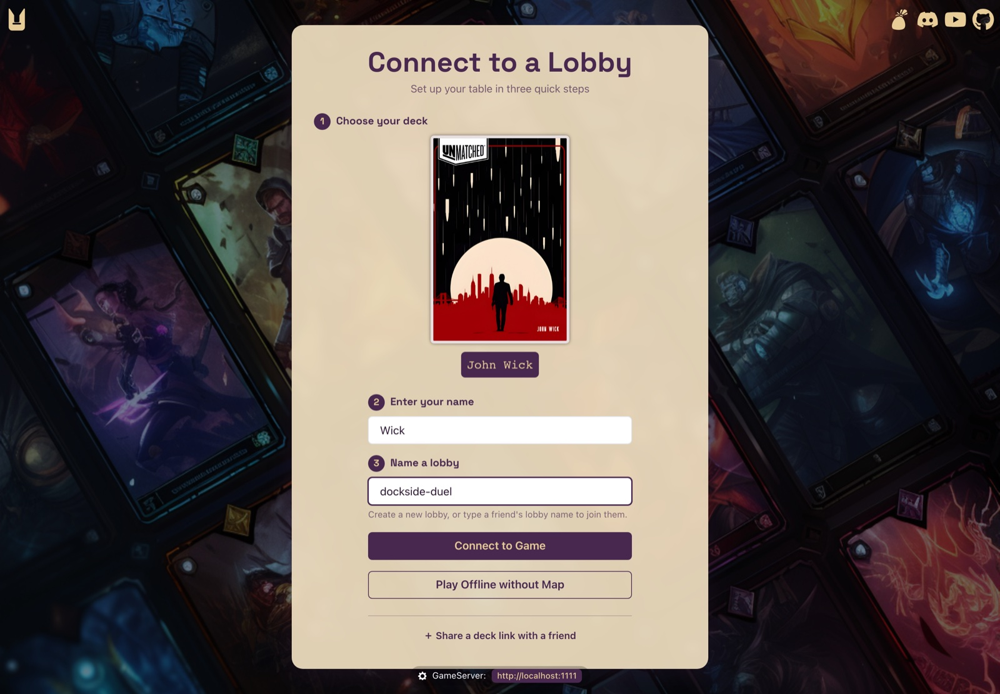
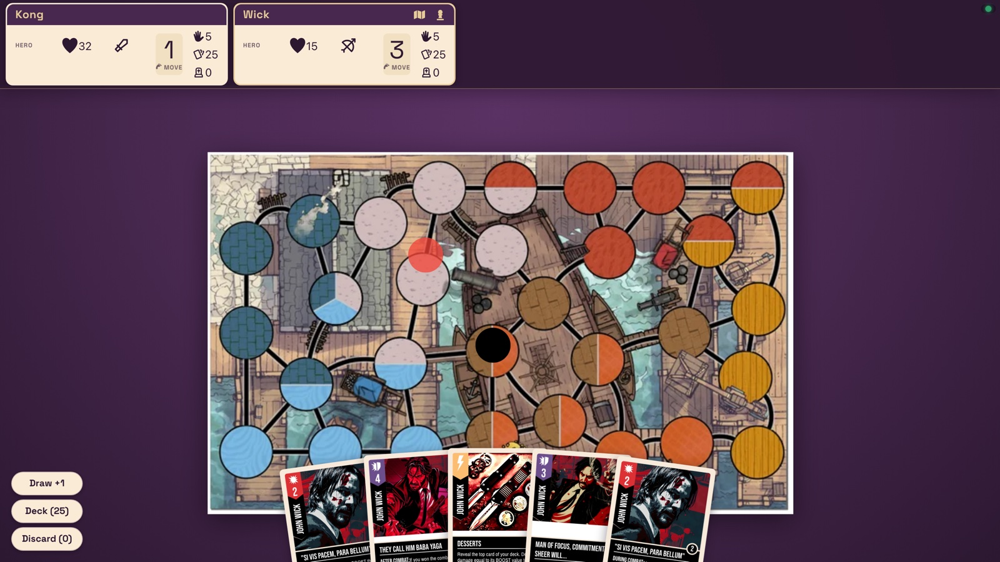
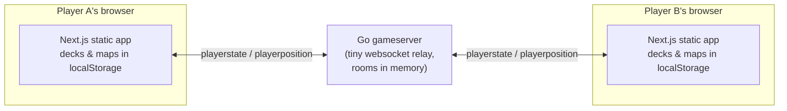

<div align="center">

# 🐰 Unbrewed

**Play your favorite [Unmatched](https://unmatched.cards) fan decks online with friends — all you need is a browser.**

[**▶ Play now at unbrewed.xyz**](https://unbrewed.xyz)

[](https://unbrewed.xyz)
[](https://discord.gg/qPxHFjwkNN)
[](https://youtube.com/playlist?list=PLjsjwAfJTj3a2NMDzOENFMwOYUzsFQn_C&si=Wi-MwpmS6loyBpB3)
[](https://nextjs.org)
[](gameserver/)



*John Wick vs King Kong, live over websocket. Hover a card to read it, drag tokens around any map.*

</div>

---

## ✨ What is Unbrewed?

[Unmatched](https://boardgamegeek.com/boardgame/274637/unmatched-game-system) has a thriving homebrew community designing custom decks on [unmatched.cards](https://unmatched.cards) — but playtesting them used to mean printing cards or wrestling with Tabletop Simulator. **Unbrewed is a free, open-source virtual tabletop built just for that:**

- 🎴 **Bring any deck** — import from unmatched.cards with one code, paste raw JSON, or load from card image URLs
- 🗺️ **Play on any map** — drop in any image URL and it syncs to everyone at the table
- 🌐 **No accounts, no installs** — share a lobby name with a friend and you're dueling
- ♻️ **Evergreen by design** — decks & maps live in your browser's localStorage, the client is a static site, and anyone can host the tiny Go gameserver

> Unbrewed is a fan-made hobby project and is not owned by or associated with Restoration Games, LLC.

## 📸 Tour

| Load up your bag | Connect in three steps |
| :---: | :---: |
|  |  |
| **The Bag** — collect decks & maps, star your favorites | **Connect** — pick a deck, name a lobby, share it with a friend |

<div align="center">
  
  <p><em>The table — shared map, color-codable tokens, life/hand/deck counters for every player.</em></p>
</div>

## 🚀 Play online (easiest)

1. Find or build a deck on [unmatched.cards](https://unmatched.cards) or any TTS deck maker like [the-unmatched.club](https://www.the-unmatched.club/c/heroes)
2. Add it to your bag at [unbrewed.xyz/bag](https://unbrewed.xyz/bag)
3. Create a lobby on [unbrewed.xyz/connect](https://unbrewed.xyz/connect)
4. Send the lobby name to a friend — that's it 🎉

A default gameserver is already live, so most players never need to run anything.

## 🛠️ Run locally

```bash
# 1. build the Go gameserver
cd gameserver && go build && cd ..

# 2. start the gameserver (ws relay on :1111)
yarn server

# 3. in another terminal, start the web app
yarn install
yarn dev
```

Open http://localhost:3000, then point the app at your local server on the settings page (`http://localhost:1111`).

## 🌍 Host a gameserver for friends

You can run the server on your own machine — free, and independent of Unbrewed's servers ever going offline:

1. `cd gameserver && go build`
2. `cd ../ && yarn server` — relay now running on `localhost:1111`
3. Sign up for a free [ngrok](https://ngrok.com) account
4. In a new terminal: `yarn grok` and copy the public URL it prints
5. Paste that URL at [unbrewed.xyz/settings](https://unbrewed.xyz/settings) — and share it with your friends so they connect to the same server

Want to run a 24/7 public server for the community? Open an issue or PR so we can add it to the default server list. (`fly.toml` and `Dockerfile.gameserver` are included if you like [Fly.io](https://fly.io) or containers.)

## 🏗️ How it works



The server holds no game logic and no database — it just relays each player's state to everyone in the room. All deck data stays in the browser, and the client exports as a fully static site (it runs on GitHub Pages). If unmatched.cards or the default server ever disappear, any static host + one Go binary keeps the game alive.

## 🍴 Fork it & deploy on GitHub Pages

Unbrewed uses Next.js static export, so your fork can run on GitHub Pages. Since Pages serves from `https://username.github.io/repo/`, update the repo name in the build steps:

- [`lib/buildTools/prefixFonts.js`](lib/buildTools/prefixFonts.js) — replace `unbrewed-p2p` with your fork's repo name
- [`next.config.js`](next.config.js) — use `NODE_ENV` to set the production `basePath` to your repo name

## 🤝 Contributing

PRs, forks, and feature requests through the [issue tracker](https://github.com/JollyGrin/unbrewed-p2p/issues) are all welcome! Come say hi on [Discord](https://discord.gg/qPxHFjwkNN).

- 📓 Curious how the project evolved? Read the [dev journal](docs/JOURNAL.md)
- 🧪 Run tests with `yarn test`

<details>
<summary><strong>How to add fonts</strong></summary>

1. Add the file to `public/fonts`
2. Update `styles/fonts.css`
3. Update `styles/styles.ts`
4. Update `lib/buildTools/prefixFonts.js` to add another HTML match for fixing production links (GitHub Pages puts the repo name in the URL)

</details>

## 🙏 Credits

- [JonG](https://github.com/JonathanGuberman) — creator of [unmatched.cards](https://unmatched.cards) (build your own Unmatched deck) and the [card template styling](https://github.com/JonathanGuberman/unmatched_maker/blob/a7e96b69559461bfac7d3203d8d3899d4af36398/src/components/UnmatchedCard.vue) Unbrewed's card renderer is based on
- The Unmatched homebrew community for the decks and maps that make this fun ❤️
