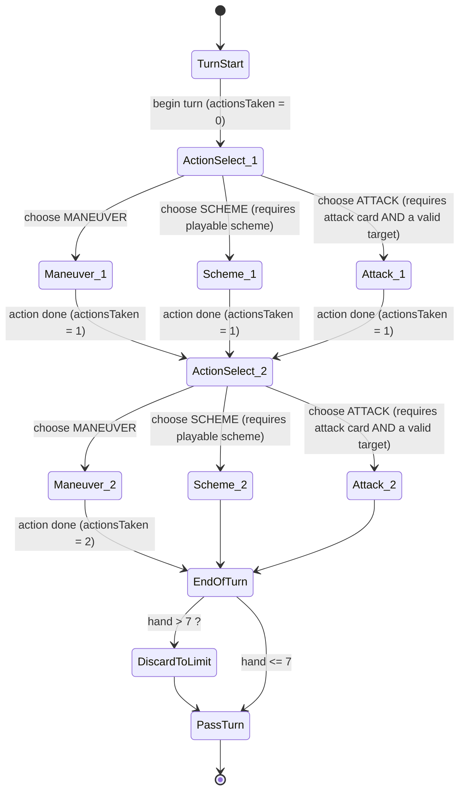
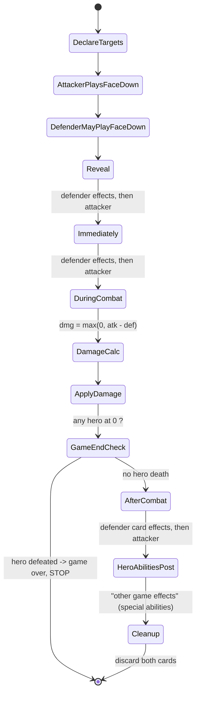

# Unmatched — Engine-Oriented Rules Specification (v1: 1v1)

> Canonical reference for building a **server-authoritative TypeScript rules engine** for
> *Unmatched* (Restoration Games / Mondo Games). Written for an implementer who has never
> played the game. Scope for v1 is **1v1 (two-player)** only; team play is documented in an
> appendix for completeness but is out of engine scope.
>
> **Primary sources** (cited inline throughout):
> - Official core rulebook — *Unmatched: Battle of Legends, Volume One* (the "Unmatched System" core rules), Restoration Games, ©2019. PDF: <https://cdn.1j1ju.com/medias/c8/82/19-unmatched-battle-of-legends-volume-one-rulebook.pdf> — hereafter **[RB]**. The identical core-system text ships in every set (e.g. <https://restorationgames.com/wp-content/uploads/2023/02/UM-TS_Rules.pdf>).
> - Community rules/FAQ compilation, Gridbeast — <https://gridbeast.gg/unmatched-rules-faq/> — hereafter **[GB]**.
> - Community "Unmatched Special Rules / Rules Reference v7" — <https://www.scribd.com/document/798271558/Unmatched-Special-Rules-v7-0-1> — hereafter **[RR]**.
> - Card database (for card-text corpus / DSL grounding) — <https://unmatched.cards/umdb/cards>.
>
> Where the rulebook and a ruling disagree or a ruling clarifies, both are quoted and the
> source marked. Anything marked **[OPEN]** is unresolved — see §10.

---

## 0. Core vocabulary (engine glossary of nouns)

These are the primitive entities the engine models. (Effect-*verbs* are in §11.)

| Term | Definition (RB) | Engine note |
|---|---|---|
| **Fighter** | Any of a player's characters in the battle. [RB] "All of your characters in the battle are called your fighters." | Base entity with position + health. |
| **Hero** | The player's *primary* fighter, a miniature. [RB] | Losing it = losing the game. |
| **Sidekick** | A player's non-hero fighter(s), represented by tokens. A hero may have one, several, or none. [RB] | May have its own health dial, or be a "1-health token." |
| **Space** | A circular location on the battlefield. **"Each space can only contain one fighter at a time."** [RB] | Graph node. Occupancy ≤ 1 fighter. |
| **Adjacent** | Two spaces connected by a line. [RB] "Adjacency is used to determine targets of attacks and various card effects." | Graph edge. Symmetric. |
| **Zone** | A set of spaces sharing a colored pattern; may be non-contiguous. "All spaces with the same colored pattern are part of the same zone (even if they are in different parts of the battlefield)." [RB] | Set membership. A space can belong to **multiple** zones. Used for ranged targeting + card effects. |
| **Deck** | The 30 action cards, shuffled, face-down. [RB] | Draw source. |
| **Hand** | Cards in hand; **limit 7 at end of turn**. [RB] | May exceed 7 mid-turn; enforce at end-of-turn only. |
| **Discard pile** | Face-up, per-player; both players may inspect it any time. [RB] | Public zone. **Never reshuffled** (see §8 exhaustion). |
| **Move value** | Per-hero stat: max spaces a fighter moves in one Maneuver move-step. [RB character card] | Same value applies to hero and sidekicks unless a card says otherwise. |
| **Attack value / Defense value** | Numbers on cards; damage = attack − defense. [RB] | See §5. |
| **Boost value** | The number in the top corner of a card, used when discarded to boost. [RB] | See §5.4. |

---

## 1. Setup

Source: **[RB]** "SETUP" (steps 1–7) and "HEROES & SIDEKICKS".

### 1.1 Deck / component construction
Each hero is a **fixed, pre-constructed deck of exactly 30 action cards** plus:
- 1 hero miniature + 1 character card (stats + special ability),
- 0..N sidekick token(s),
- health dial(s).

There is **no deckbuilding** — a hero's 30 cards are fixed by the printed set. The engine loads a hero definition (character card stats + the 30-card list). Any hero may face any other hero from any set. [RB]

Example composition (from [RB] contents):
- *Sinbad*: 30 cards, 1 hero mini, 1 Porter sidekick token, 2 health dials.
- *Medusa*: 30 cards, 1 hero mini, **3 Harpy sidekick tokens**, 1 health dial (the harpies are 1-health tokens; the single dial is Medusa's).
- *Alice*: 30 cards, 1 hero mini, 1 Alice **size token**, 1 Jabberwock sidekick token, 2 health dials.

### 1.2 Setup sequence (engine init order)
1. Choose a battlefield (board); place it. [RB step 1]
2. Each player picks a hero and takes its 30 cards, character card, mini, sidekick tokens, dials. [RB step 2]
3. Set each fighter's starting health on its dial. **Sidekicks without a health dial have exactly 1 health each.** [RB step 3]
4. Each player **shuffles their 30 cards into a single deck, face down, then draws 5** as their starting hand. [RB step 4]
5. **Placement / first player is decided by "youngest first":**
   - The **younger** player places their hero in the **"1" starting space**, then places each sidekick in **separate spaces within the same zone** as the hero. If the hero's space is multi-zone, sidekicks may be in any of those zones. Make any start-of-game fighter decision now (e.g. Alice's size). [RB step 5]
   - The **older** player places their hero in the **"2" starting space** and places sidekicks by the same rule. [RB step 6]
   - **The younger player takes the first turn.** [RB step 7]

> **Engine substitution:** "younger/older" is a human tiebreak. The engine substitutes a
> deterministic/negotiated **first-player choice** (coin flip, seat assignment, or lobby
> setting). The load-bearing facts are: (a) player A places hero on space "1" + sidekicks in
> hero's zone; (b) player B places hero on space "2" + sidekicks in hero's zone; (c) **the
> player who placed on space "1" takes the first turn.**

### 1.3 Sidekick placement constraints (from ruling)
At game start a sidekick must be placed **in the hero's zone**; only if **no space is
available in that zone** may it be placed outside, and then it **must be adjacent to one of
your fighters**. [GB] This start-of-game constraint does **not** apply to sidekicks
*returned to the board later* by a card effect. [GB]

---

## 2. Turn structure (state machine)

Source: **[RB]** "YOUR TURN".

**Hard rule: On your turn you take exactly 2 actions; you cannot skip an action.** The two
actions may be the **same type twice or two different types**. [RB] After the second action,
enforce hand limit, then pass. [RB]

The three action types:
- **MANEUVER** — draw 1 (mandatory), then optionally move fighters.
- **SCHEME** — play a scheme card face-up for its effect.
- **ATTACK** — play an attack/versatile card vs an in-range enemy fighter.

### 2.1 Turn state diagram

> **Note on "gain an action":** some card effects grant **extra actions** (e.g. "Gain 1
> action") or **bonus attacks**. Model `actionsRemaining` as a counter initialized to 2 per
> turn, decremented per action, incrementable by effects, rather than two hard slots. A
> **bonus attack** granted by a card is *not* a full "action" and does not consume an action
> slot (see §5.6). The turn ends when `actionsRemaining == 0` and no pending bonus/extra
> steps exist.

### 2.2 Legality gates per action (engine preconditions)
- **MANEUVER:** always legal (you can always draw; move-step is optional and can be 0). [RB]
- **SCHEME:** legal only if the player holds a scheme card **whose listed fighter(s) are
  alive** and playable. "You may not play a scheme card if the listed fighters are
  defeated." [RB]
- **ATTACK:** **"You may not take the attack action if you do not have an attack card in
  hand or if none of your fighters have valid targets to attack."** [RB] I.e. requires both
  (≥1 attack-or-versatile card the active fighter may use) **and** (≥1 in-range enemy
  fighter for some fighter of yours).

If neither Scheme nor Attack is legal, the player may still Maneuver (always available), so a
player is never stuck — Maneuver twice is always a legal turn.

---

## 3. Movement

Source: **[RB]** "ACTION: MANEUVER → STEP 2: MOVE YOUR FIGHTERS".

### 3.1 Move-step mechanics
- The move step happens **only within a Maneuver action** (STEP 1 draw is mandatory; STEP 2
  move is optional). [RB]
- You may move **each of your fighters, one at a time, up to your move value** (0..moveValue
  spaces). [RB]
- **Split freely:** "You may move your fighters in the order of your choice, but must finish
  each fighter's move before starting the next. You are not required to move all of your
  fighters the same distance... You are allowed to move a fighter zero spaces." [RB]
- **Path rule:** "each space they move into must be adjacent to their previous space." [RB]
  Movement is edge-by-edge along the adjacency graph.

### 3.2 Passing through / ending
- **Through friendly:** "You may move a fighter through spaces occupied by other friendly
  fighters (i.e., your own fighters)..." [RB]
- **Cannot end on occupied:** "...but they cannot end their movement in an occupied space."
  [RB] (Occupied by any fighter, friend or foe.)
- **Cannot pass through enemies:** "You may not move a fighter through spaces occupied by
  opposing fighters." [RB] (unless a specific card grants it.)
- Moving an **opponent's** fighter (via an effect) obeys **all the same rules from the
  opponent's perspective**. [RB]

### 3.3 Movement vs. Placement (critical engine distinction)
- **Move** = traverse adjacency edges, respecting §3.2 (blocked by enemies, must be a legal
  path). [GB]
- **Place** = teleport to a target space **without following paths** and (per card text)
  often ignoring the usual movement restrictions. "'Move' requires following board paths;
  'place' doesn't follow set paths." [GB] Cards such as *Disengage* officially use "place."
  [GB]
- **Forced move with nowhere to go:** "the effect still resolves, except your fighter remains
  in the current space" — i.e. a forced move that has no legal destination is a legal no-op,
  not an error. [GB]

Engine: implement `move(fighter, path[])` (validates each edge, enemy-block, end-occupancy)
and a separate `place(fighter, space)` (validates only that the target is unoccupied — or
per card, may allow a swap). Card DSL must distinguish the two verbs.

### 3.4 Boosting movement
During a Maneuver you may **boost your movement**: discard 1 card from hand and add **that
card's boost value** to your move value; **ignore any effect on the discarded card**. [RB]
See §5.4 for general boost rules.

---

## 4. Spaces, zones, and attack range

Source: **[RB]** "THE FIELD OF BATTLE / SPACES AND ZONES" and "ACTION: ATTACK → STEP 1".

### 4.1 Model
- Battlefield = graph of **spaces** (nodes) with **adjacency edges** (undirected). One
  fighter per space max. [RB]
- Each space belongs to **one or more zones**. Multi-zone spaces are in all their zones
  simultaneously. [RB]

### 4.2 Attack range (targeting eligibility) — **STEP 1: DECLARE TARGET** [RB]
- **Any fighter** may target a fighter in an **adjacent space**, regardless of zone. [RB]
- **Melee** fighters (melee icon) may target **only an adjacent** fighter. [RB]
- **Ranged** fighters (ranged icon) may target an **adjacent** fighter **OR any fighter in
  the same zone**, regardless of adjacency. [RB] (Ranged is a superset of melee reach.)

So `inRange(attacker, target)`:
- melee attacker → `adjacent(attacker.space, target.space)`
- ranged attacker → `adjacent(...) || sharesZone(attacker.space, target.space)`

where `sharesZone(a,b)` is true if the two spaces share **any** zone.

### 4.3 Adjacency edge cases (rulings)
- A fighter's **own** space is **not** "an adjacent space" for effects that target adjacent
  spaces — unless the fighter is a **small fighter** (e.g. squirrels), which *is* considered
  adjacent to its own space for adjacency effects and attacks. [GB]
- **Token stacking:** normally one fighter per space, but some effects create non-fighter
  tokens; **different** tokens may share a space, **identical** tokens may not stack. [GB]
  (v1 can treat sidekick/hero fighters as strictly 1-per-space; special tokens are a later
  concern.)

---

## 5. Combat sequence (precise timeline)

Source: **[RB]** "ACTION: ATTACK" (STEP 1–3), "COMBAT EXAMPLE", "WINNING THE COMBAT"; plus
rulings **[GB]/[RR]**.

Combat is the heart of the engine. It is a **strict, ordered pipeline** with defined
decision points. Both cards are chosen **hidden**, then revealed simultaneously.

### 5.1 Attack action pipeline

**STEP 1 — Declare attacker + target** [RB]
1. Active player declares which of their fighters is the **active fighter** (the attacker).
2. Declare a **target** enemy fighter satisfying §4.2 range for that attacker.
   - Precondition (from §2.2): must hold a usable attack/versatile card AND have a valid
     target, else the Attack action is illegal.

**STEP 2 — Choose and reveal** [RB]
3. **Attacker** chooses an **attack card** (or versatile used as attack) from hand and plays
   it **face down**. It must be a card **that fighter is allowed to use** (name restriction —
   §6). [RB]
4. **Defender** *may* (not required) choose a **defense card** (or versatile used as defense)
   from hand and play it **face down**. It must be a card the **defending fighter** is
   allowed to use. [RB]
5. **Reveal simultaneously.** [RB]

**STEP 3 — Resolve combat** [RB] — the timing pipeline in §5.2.

### 5.2 Effect timing windows (exact order)

Card effects carry one of three timing labels: **IMMEDIATELY**, **DURING COMBAT**, **AFTER
COMBAT**. "Unless otherwise specified, card effects are mandatory." [RB]

**Global tiebreak rule:** **"If two effects would ever appear to resolve at the same time,
the defender's effect resolves first."** [RB] Applies within every window below.

Resolution order after reveal ([RB], verbatim structure):

1. **IMMEDIATELY window** — "After cards have been revealed, resolve any effects that occur
   immediately." Order within window: **defender's immediate effects first, then
   attacker's.** [RB tiebreak] + [GB] ("The defender's immediate effects will always resolve
   first, even before an attacker's immediate card effects.")
2. **DURING COMBAT window** — "Then resolve any effects that occur during combat." Defender
   first on ties. [RB]
3. **DAMAGE CALCULATION** — "determine the result of the combat. The attacker deals damage to
   the defender equal to the value of their played attack card. If the defender played a
   defense card, subtract the value of their played defense card first. For each damage the
   defender takes, reduce that fighter's health by one." [RB]
   - `damage = max(0, attackValue - defenseValue)` where `defenseValue = 0` if no defense
     card was played. (Values may be modified by IMMEDIATELY/DURING effects and boosts.)
   - Apply damage; adjust health dial; a fighter at 0 is **defeated** (§7, §8).
4. **AFTER COMBAT window** — "After the result of the combat has been determined, resolve any
   card effects that occur after combat." Defender's after-combat effects first, then
   attacker's. [RB]/[GB]
   - **"Even if a player's fighter is defeated during the combat, as long as that does not
     trigger the end of the game, any after combat effects of their played card still
     resolve."** [RB] (A defeated *sidekick's* card still fires its after-combat effect; a
     defeated *hero* ends the game and nothing further resolves — §7.)
5. **OTHER after-combat game effects** — "After card effects are resolved, resolve any other
   game effects that occur after combat, such as a hero's special ability." [RB] (E.g. King
   Arthur's ability that boosts an attack triggers here as a hero-ability post-combat step.)
6. **CLEANUP** — "Finally, all played cards are placed in their respective discard piles."
   [RB]

### 5.3 "Winning the combat" (needed by many after-combat effects) [RB]
- **Attacker won** the combat iff they dealt **≥1 damage to the defender from the attack
  itself** (i.e. from the attack value minus defense — **not** from any effect). [RB]
- **Defender won** the combat iff they took **no damage from the attack itself** (even if
  they took damage from effects). [RB]
- Corollary ruling: "If no damage during the combat phase occurs, the defender is considered
  the winner." [GB] — a **tie of values (atk == def) means the defender wins** the combat
  (attacker dealt 0). This is the [RB] combat example: Jaws-That-Bite 4 vs Skirmish 4 → 0
  damage → **King Arthur (defender) wins the combat**.

Engine: compute `combatDamageFromAttack = max(0, effectiveAttack - effectiveDefense)` **at
the damage-calc step, before after-combat effects**, and store `attackerWon =
combatDamageFromAttack >= 1`. After-combat "if you won"/"if you lost" effects read this
stored flag, so later health changes from effects don't retroactively alter who "won."

### 5.4 Boosting (in combat and elsewhere)
General boost mechanic [RB]: **discard 1 card from hand and add its BOOST value** to some
value; **ignore the discarded card's effect**.

- **Movement boost:** always available during a Maneuver move step (§3.4). [RB]
- **Effect/attack boost:** boosting *other* things (e.g. an attack's value) happens **only
  when a card or ability explicitly grants it** — "Certain effects (like King Arthur's
  special ability) allow you to boost other things, such as the value of an attack." [RB]
  There is **no general 'boost your attack' option**; it must be granted by a card/ability.
- **A card with no boost value cannot be used to boost.** "a card must have a boost value to
  be considered a valid option." [GB]
- **Cards that can no longer be legally played** (their fighter is defeated) **may still be
  discarded to boost.** [RB]
- **Boost stacking:** if two separate sources each grant an attack-boost, they **stack** (you
  may boost twice, discarding two cards). [GB]
- Discarded boost cards go to the discard pile; their printed effect is ignored. [RB]

### 5.5 Cancellation ("cancel effects") — engine-critical
This is one of the trickiest areas; treat carefully.

- **Definition of "an effect":** an *effect* is the text that "happens in the same step with
  nothing in between." Each of **IMMEDIATELY**, **DURING COMBAT**, **AFTER COMBAT** is a
  **separate effect** on the card. [RR] So a cancel that says "cancel the effect(s)" of a
  card/window cancels only the text **within the referenced timing step**, not the whole
  card. [RR]
- **What is NOT an effect (cannot be canceled by effect-cancels like *Feint*):** a card's
  **printed attack/defense value**, and an **attack bonus/boost is not "an effect on the
  card."** "because an attack bonus is not an effect on the card, it cannot be canceled by
  cards like Feint." [RR]
- **Versatile cards are attack AND defense for all purposes:** "If a card effect refers
  explicitly to an attack or defense card, does it apply to a versatile card? Yes. All cards
  are considered attack or defense during combat." [GB]
- **Defender immediacy vs. cancel:** the **defender's immediate effects still resolve first**
  and can fire before an attacker's cancellation resolves. [GB] So an attacker's "cancel the
  defender's immediate effect" may or may not land depending on exact wording/ordering — see
  **[OPEN]** §10.
- Some cards are explicitly **"cannot be canceled"** / immune; and an item attached by such a
  card is likewise uncancelable. [GB]

Engine model: represent each card as up to three discrete **timed effect blocks**
(`immediately`, `duringCombat`, `afterCombat`), each independently cancelable. Values and
boosts are **separate, non-effect properties** and are immune to generic effect-cancels.
Cancel effects target a **scope** (a specific window on a specific card / "all effects on a
card" / "all X effects in this combat"), and the DSL must express that scope precisely.

### 5.6 Bonus attacks (some cards grant an immediate extra attack)
- A **bonus attack** is a distinct attack that happens **within/after the current combat's
  resolution**, granted by a card, and **does not consume one of your 2 actions**. [GB]
- Triggers **unless the defender was defeated during the first attack**. Triggers **even if
  the attacker is defeated** (but the defender still won the *first* attack). [GB]
- Range for the bonus attack is checked at trigger time but distance changes don't cancel it:
  "Bonus attacks will trigger despite the distance between fighters." [GB]
- If the defender used a card to **swap places** during the first attack, the fighter swapped
  in **becomes the new defender for both attacks.** [GB]

---

## 6. Card anatomy

Source: **[RB]** "ANATOMY OF A CARD" + "ICON REFERENCE".

A card (30 per deck) has these fields [RB labels A–H]:

| Field | Meaning | Engine type |
|---|---|---|
| **A. Card type** | One of: **Attack** / **Defense** / **Scheme** / **Versatile**. Versatile = usable as attack *or* defense. [RB] | `enum CardType { Attack, Defense, Scheme, Versatile }` |
| **B. Value** | Attack or defense value (if any). Schemes have none. | `number \| null` |
| **C. Fighter allowed** | Which fighter may use the card: a specific hero **name**, a sidekick, or **ANY**. [RB] | `usableBy: HeroName \| SidekickName \| "ANY"` |
| **D. Name** | Card name (for effect references / identity). | `string` |
| **E. Effect text** | Effect when played, with timing label(s). | `EffectBlock[]` (see §5.5) |
| **F. Boost value** | Number used when discarded to boost; may be absent. [RB] | `number \| null` |
| **G. Deck** | The deck the card belongs to. [RB] | metadata |
| **H. Quantity** | Number of copies of this card in that deck. [RB] | `count: number` |

**Icon reference** [RB], for type/reach parsing:
- Attack-only icon → card usable only to attack.
- Defense-only icon → card usable only to defend.
- Versatile icon (the "any"/dual icon) → attack **or** defend; counts as **both** for effects.
- Scheme icon (lightning bolt) → "As an action, this card can be played for its effect."
- Fighter reach icons on the **character card**: ranged-capable (melee + ranged) vs.
  melee-only. [RB]

**Usability rules:**
- A card whose listed fighter is **defeated cannot be played** (as attack/defense/scheme) but
  **can still be discarded to boost.** [RB]
- Some cards list a **specific fighter** (e.g. "ALICE" only) — that card can only be used
  when that fighter is the active/defending fighter. In the [RB] example, Alice cannot play
  *Snicker-Snack* to defend because Alice isn't the fighter in that combat.
- `usableBy: ANY` cards (marked "ANY") can be used by any of that deck's fighters. [RB]

> **Note:** each hero's 30-card list, per-card values, boosts, timing effects, and quantities
> are **content data**, not rules. The engine needs a **card-definition schema** (§11 DSL)
> plus a data file per hero. This doc specifies the *rules skeleton*; the card corpus lives
> at <https://unmatched.cards/umdb/cards>.

---

## 7. Sidekicks & multi-figure fighters

Source: **[RB]** "HEROES & SIDEKICKS", "DEFEATING A FIGHTER".

- A hero has **0, 1, or several** sidekicks. [RB]
- **Two sidekick health models:**
  1. **Health-dial sidekick** (e.g. Sinbad's Porter, Alice's Jabberwock): has its own
     health dial with a starting health; takes/tracks damage like the hero. [RB]
  2. **Token sidekick / no dial** (e.g. Medusa's 3 Harpies): **each has exactly 1 health**
     and "is defeated if they take any damage." The character card lists the **total number**
     of such sidekicks instead of a per-sidekick health. [RB]
- **Fighters cannot heal above the max on their health dial.** [RB]
- Sidekicks **attack and defend** using cards their fighter is allowed to use (name
  restriction, §6). Many decks have cards usable only by the sidekick, only by the hero, or
  by ANY. [RB]
- **Sidekick defeat:** "If your hero's sidekick is defeated, immediately remove that sidekick
  token from the battlefield." A defeated sidekick's **after-combat card effect still
  resolves** (§5.2 step 4). [RB]
- **Hero defeat = immediate loss** (§8). [RB]
- **Multiple figures:** heroes with multiple sidekicks control several tokens; each is an
  independent fighter for movement/targeting. A single Maneuver can move **all** your
  fighters (each up to move value). [RB]

Engine: `Fighter { id, kind: Hero|Sidekick, ownerId, space, health, maxHealth, isTokenOneHP }`.
`isTokenOneHP` sidekicks have `maxHealth = 1` and die on any damage.

---

## 8. Win / loss & running out of deck

Source: **[RB]** "DEFEATING A FIGHTER", "WINNING THE GAME", "DRAWING CARDS".

### 8.1 Win / loss
- A fighter at **0 health is defeated** (for any reason). [RB]
- **"If your hero is defeated, you immediately lose the game."** [RB]
- **"When your opponent's hero is defeated... the game ends immediately and you win!"** [RB]
- Sidekick death does **not** lose the game; only hero death does. [RB]

### 8.2 Simultaneous / edge-case deaths
- If both heroes would be reduced to 0 in the same combat / at the same instant: **the player
  who initiated the action (the active player, i.e. whose turn it is / the attacker) wins.**
  [GB] ("The player who initiated the action wins; in other words, the player whose turn it
  is.")
- Because a hero reaching 0 **ends the game immediately**, after-combat effects that would
  otherwise fire **do not resolve once the game has ended** (§5.2 note: "as long as that does
  not trigger the end of the game"). [RB]

Engine: check hero-death **at the moment health hits 0** (during damage application and after
any effect that deals damage). If the *turn player's* hero and the opponent's hero both hit 0
in the same resolution step, **turn player wins**. If only one hero is at 0, that hero's owner
loses immediately and resolution halts.

### 8.3 Empty deck = "exhaustion" (you do NOT lose)
"When your deck is empty, your fighters are exhausted." [RB]
- **The discard pile is never reshuffled.** [RB]
- **If you must draw while exhausted, do not reshuffle. Instead each of your fighters
  immediately takes 2 damage.** [RB] (Per forced draw event.)
- Timing: "The moment a player has to draw a card from their deck and can't, the damage will
  occur." [GB]
- **Exhaustion damage applies only to forced *draws*, not other deck interactions:** if a
  card forces an exhausted opponent to **discard the top card of their deck** (not draw),
  they take **no** exhaustion damage. [GB]
- Drawing (via Maneuver or effect) is otherwise **mandatory unless the card says
  otherwise.** [RB]

So running out of cards is a **slow self-damage clock**, never an instant loss. A Maneuver
while exhausted still "draws" → deals 2 damage to *each* of your fighters (including your
hero), which can eventually kill your hero.

### 8.4 Hand limit
- Limit is **7 at end of your turn**; you may exceed 7 during your turn but must discard down
  to 7 at end of turn. [RB]
- **Forced draws outside your turn do NOT trigger discarding** — "the limit of 7... only
  applies at the end of your turn." [GB]

---

## 9. Enumerated decision points & prompt/response protocol

Every point where a player makes a choice **or could optionally trigger/decline an effect**.
This is the engine's **prompt protocol**. Prompts with **no legal option are auto-skipped**
(MTG-Arena style). Marked **[AUTO-SKIP]** where the engine may resolve without asking.

**Turn-level**
1. **Choose action #1** (Maneuver / Scheme / Attack) — filtered to legal actions (§2.2).
2. **Choose action #2** — same.
3. **End-of-turn discard** to 7 — prompt only if hand > 7; else **[AUTO-SKIP]**. Player
   picks which cards to discard.

**Maneuver action**
4. Draw top card — **[AUTO-SKIP]** (mandatory, automatic; if exhausted, auto-apply 2 dmg to
   all your fighters).
5. Move step: for each of your fighters, choose a path of 0..(moveValue + boost) legal spaces.
   Player chooses order of fighters and distances. **[AUTO-SKIP]** if the player declines to
   move any fighter.
6. Optional **movement boost**: discard a card (with a boost value) to add its boost to move
   value. Prompt only if the player has ≥1 card with a boost value; may decline.

**Scheme action**
7. Choose which scheme card to play (from playable schemes) and which fighter is active.
8. Resolve scheme effect — may contain nested choices (targets, options) per card DSL.

**Attack action**
9. Choose **active fighter** (attacker) — among your fighters that have ≥1 valid target and a
   usable attack card.
10. Choose **target** enemy fighter (in range per §4.2).
11. Choose **attack card** to play face down (usable by the attacker).
12. **Defender: choose whether to play a defense card**, and if so which (usable by the
    defender). May decline. **[AUTO-SKIP]** if the defender holds no usable defense/versatile
    card.
13. **Reveal** — automatic.
14. **IMMEDIATELY effects** — resolve defender's then attacker's; each effect may prompt for
    its own sub-choices (targets, optional "you may", boosts granted). **[AUTO-SKIP]** any
    window/effect with no card carrying it or no legal choice.
15. **DURING COMBAT effects** — same ordering/prompting.
16. **Damage calc** — automatic; store `attackerWon`.
17. Hero-death check — automatic; may end game.
18. **AFTER COMBAT effects** — defender's then attacker's; each may prompt (e.g. "you may
    move," "you may deal 2 to any adjacent fighter," "choose to boost health"). Optional
    ("may") effects prompt yes/no; mandatory effects auto-resolve but may still prompt for a
    required target choice.
19. **Other post-combat game effects** (hero special abilities) — resolve; may prompt.
20. **Cleanup** — discard both combat cards — **[AUTO-SKIP]**.

**Any-time / triggered**
21. **Boost prompts** wherever a card/ability *grants* an attack/effect boost — optional,
    may stack (§5.4).
22. **Start-of-turn / special-ability triggers** (e.g. Medusa "At the start of your turn, you
    may deal 1 damage to an opposing fighter in Medusa's zone") — prompt at the labeled
    window; "may" → optional. [RB character card example]
23. **Choices forced by opponent's effect** (e.g. "look at opponent's hand and choose,"
    forced discards, forced moves) — prompt the affected player as directed.

**Auto-skip rule (general):** the engine evaluates the legal-choice set for each prompt; if
empty (no cards with that timing, no valid targets, no boostable cards, etc.) it resolves the
window with no player interaction. This mirrors "resolve any effects that occur..." — if none
exist, nothing happens. [RB]

---

## 10. Ambiguities & open rules questions [OPEN]

Items to decide explicitly during implementation. Each notes the source of ambiguity.

1. **[OPEN] Attacker cancel vs. defender's already-resolved immediate effect.** Rules say
   defender's immediate effects resolve first [RB/GB], but an attacker's card may say "cancel
   the defender's card effects." If the defender's immediate effect *already resolved*, does a
   later attacker cancel do nothing, or does simultaneity mean the cancel pre-empts? Community
   guidance: cancels that are themselves *immediate* interact by the defender-first rule, so
   an **attacker's** immediate cancel resolves *after* the defender's immediate effect and
   thus **cannot** retroactively undo it — but wording varies per card. **Decision needed:**
   define cancel resolution as "cancels apply to effects not yet resolved," and encode
   per-card exceptions.

2. **[OPEN] Scope of "cancel all effects."** [RR] says each timing window is a separate
   effect; but cards phrase cancels differently ("cancel all effects on this card," "cancel
   the effect," "cancel all card effects"). We must map each real card's exact wording to a
   scope: {single-window, whole-card, all-cards-this-combat}. Requires per-card review of the
   card corpus.

3. **[OPEN] Value/boost immunity to cancels** is asserted by [RR] (attack bonus is not "an
   effect," value is not "an effect"). Confirm against any card that explicitly says "set
   this card's value to X" (e.g. Sinbad's *Momentous Shift* "this card's value is 5
   instead") — is that a cancelable DURING-COMBAT *effect* or a value property? It's printed
   as a **DURING COMBAT effect**, so it **is** cancelable, unlike a static printed value.
   Distinguish "printed value" (immune) from "effect that changes value" (cancelable).

4. **[OPEN] Simultaneous hero death tiebreak** — [GB] says active player wins; the [RB] core
   rulebook does **not** state this explicitly (it only says hero-at-0 = immediate loss/end).
   Adopt the [GB] community ruling (turn player / attacker wins) but flag as not-in-core.

5. **[OPEN] "Winning combat" with 0-value attacks / all-damage-from-effects.** [RB] is clear
   that only *attack-value* damage counts for who-won, and effect damage doesn't. Confirm the
   stored `attackerWon` flag is computed strictly at damage-calc (§5.3) and never mutated by
   after-combat effects. (We adopt this; listed for test coverage, not truly open.)

6. **[OPEN] Multi-zone ranged targeting** — a space in multiple zones: a ranged attacker on a
   multi-zone space can target anything sharing *any* of its zones. Confirmed by [RB] zone
   text ("part of multiple zones"), but worth explicit test cases for boards with heavy
   overlap.

7. **[OPEN] Exhaustion damage vs. multi-fighter timing** — "each of your fighters takes 2
   damage" on a forced draw: if that kills your hero, you lose immediately even on your own
   Maneuver. Confirm order (damage all fighters, then check deaths) and whether hero + sidekick
   dying together from exhaustion matters (it doesn't for win/loss — hero death ends it).

8. **[OPEN] Bonus attack as a nested combat** — §5.6: implement bonus attacks as a recursive
   combat sub-pipeline that can itself have IMMEDIATELY/DURING/AFTER windows, defender may
   again choose a defense card, and it does not consume an action. Confirm defenders may play
   a *second* defense card for the bonus attack (they may). Swap-in retargeting per [GB].

9. **[OPEN] "Place" vs "move" per card** — the corpus has drift ("Disengage" older text says
   "move," official says "place"). Normalize every movement-verb card to move/place in the
   card data; don't infer from rules alone. [GB]

10. **[OPEN] Character special-ability timing windows** vary per hero (start-of-turn, during
    combat, after combat). These are effectively cards-without-a-card; model each hero's
    special ability as a set of timed triggers in the hero definition, resolving at the same
    windows as card effects (hero abilities resolve at the "other game effects after combat"
    step per [RB], or their own labeled window like Medusa's start-of-turn). Needs per-hero
    encoding.

---

## 11. Effect-keyword glossary (feeds the card-effect DSL)

Timing labels and effect verbs **as they appear in official card text** [RB examples, card
corpus <https://unmatched.cards/umdb/cards>]. This is the seed vocabulary for a card DSL.

### 11.1 Timing labels (each becomes a discrete, individually-cancelable effect block)
| Label | Window (see §5.2) |
|---|---|
| `IMMEDIATELY:` | Resolve right after reveal, before during/damage. Defender-first. |
| `DURING COMBAT:` | After immediately, before damage calc. Can alter values. Defender-first. |
| `AFTER COMBAT:` | After damage applied. Defender-first. Fires even if the fighter died (unless game ended). |
| *(start-of-turn / ability text on character card)* | Hero special-ability window, e.g. "At the start of your turn, you may…". |

### 11.2 Effect verbs / phrases (DSL primitives)
| Phrase (as printed) | Semantics | Engine primitive |
|---|---|---|
| `Deal X damage [to <target>]` | Reduce target health by X (bypasses defense; it is not "combat damage from the attack"). | `dealDamage(target, X)` |
| `Move [<fighter>] up to X spaces` | Legal path movement, ≤ X, respecting §3.2. | `move(fighter, ≤X)` |
| `Place <fighter> [in/on <space>]` | Teleport, ignores paths (§3.3). | `place(fighter, space)` |
| `Draw X card(s)` | Mandatory draw (exhaustion applies). | `draw(player, X)` |
| `Discard X card(s)` | From hand (self) or "top of deck" (targeted); note discard-top ≠ draw for exhaustion (§8.3). | `discardHand(...)` / `discardTop(...)` |
| `Gain X action(s)` | Increment `actionsRemaining`. | `gainActions(X)` |
| `Cancel all effects on <card>` / `Cancel the effect` | Remove not-yet-resolved effect block(s) in the referenced scope (§5.5). Does **not** touch printed values/boosts. | `cancel(scope)` |
| `This card's value is X instead` | A DURING-COMBAT value override (cancelable effect, not a printed value). | `setCombatValue(card, X)` |
| `Boost this attack` / `+X to <value>` | Grant a boost opportunity (discard a boosted card) or a flat modifier; only when granted. Stacks (§5.4). | `grantBoost(target)` / `modifyValue(+X)` |
| `If you won the combat, …` / `If you lost, …` | Gate on stored `attackerWon` (§5.3). | `if(attackerWon)` / `if(!attackerWon)` |
| `You may …` | Optional effect → yes/no prompt (§9). | `optional(effect)` |
| `Choose <n> …` / `Choose either …` | Player selects among options/targets. | `choose(options)` |
| `Recover X health` / `Heal X` | Increase health, **capped at dial max** (§7). | `heal(fighter, X)` capped |
| `Take an extra/bonus attack` | Nested combat, no action cost (§5.6). | `bonusAttack(...)` |
| `Look at opponent's hand` | Reveal hidden info to the acting player. | `revealHand(opponent)` |
| `Adjacent` / `in <fighter>'s zone` | Targeting predicates (§4). Note own-space exclusion + small-fighter exception (§4.3). | `adjacentTargets()` / `zoneTargets()` |

> The DSL should treat every card as: `{ type, usableBy, value?, boost?, effects: [ {timing,
> ops[]} ] }`, where `ops` are the primitives above. Timing blocks are the cancelable units;
> `value`/`boost` are immune-to-cancel properties.

---

## Appendix A — Team play (out of v1 scope, for completeness)

[RB] "TEAM PLAY": 2v2 (or 3-player with one player running two heroes). Teammates sit
adjacent, share information, each controls own fighters (teammate fighters are "friendly").
Turn order alternates A1, B1, A2, B2. A player whose hero dies keeps taking turns while they
have ≥1 sidekick; all-fighters-dead = eliminated. A team loses only when **both** its heroes
are defeated. Requires a 4-start-space board. **The v1 engine implements 1v1 only.**

---

## Appendix B — Source list

- **[RB]** *Unmatched: Battle of Legends, Volume One* rulebook (core "Unmatched System"),
  Restoration Games ©2019 — <https://cdn.1j1ju.com/medias/c8/82/19-unmatched-battle-of-legends-volume-one-rulebook.pdf>
  (identical core text: <https://restorationgames.com/wp-content/uploads/2023/02/UM-TS_Rules.pdf>,
  <https://restorationgames.com/wp-content/uploads/2022/09/UM-HvG_Rules-two-page.pdf>).
- **[GB]** Gridbeast — *Unmatched Rules & FAQ* — <https://gridbeast.gg/unmatched-rules-faq/>
- **[RR]** *Unmatched Special Rules / Rules Reference v7* — <https://www.scribd.com/document/798271558/Unmatched-Special-Rules-v7-0-1>
- Card corpus / anatomy grounding — Unmatched Maker DB — <https://unmatched.cards/umdb/cards>
- Overview — Wikipedia, *Unmatched (board game)* — <https://en.wikipedia.org/wiki/Unmatched_(board_game)>
- Publisher hub — <https://restorationgames.com/unmatched/>
