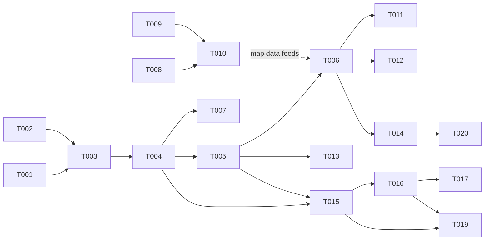

# Unbrewed Pro — Task Board

Project management for the rules-enforced mode. Each `T-###-*.md` file is one
ticket, written to be picked up cold by any agent/session. **Read
`docs/pro/01-context.md` before any ticket** — decisions recorded there are
settled; tickets implement, they don't relitigate.

## How to work a ticket

1. Pick the lowest-numbered ticket whose `Status: ready` and whose
   `Depends on` tickets are all `done`.
2. Check the **`More info needed`** line at the top. If it isn't `NONE`, get the
   answer from the user FIRST — do not guess and build.
3. Check the **`Repo`** line — engine/server tickets are worked in a session
   opened in `~/git/unbrewed-pro-server` (private); UI tickets in this repo.
4. Edit the ticket header (`Status: in-progress`, then `done`), and append a
   short **Result** section (what landed, commits, deviations) when finishing.
   Commit the ticket edit with the work.
5. A ticket is done only when its Acceptance criteria all hold (tests included).

Statuses: `ready` · `blocked` (dependency not done) · `needs-info` ·
`in-progress` · `done`.

## Board (update this table when statuses change)

| # | Ticket | Repo | Status | Depends on |
|---|---|---|---|---|
| T-001 | Engine: core types, state & seeded RNG | pro-server | ready | — |
| T-002 | Engine: map graph & spatial queries | pro-server | ready | — |
| T-003 | Engine: turn state machine & legalActions | pro-server | blocked | T-001, T-002 |
| T-004 | Engine: combat pipeline | pro-server | blocked | T-003 |
| T-005 | Engine: effect interpreter (DSL v0.1) | pro-server | blocked | T-004 |
| T-006 | Content: King Kong (hand-authored) | pro-server | blocked | T-005 |
| T-007 | Engine: random-playout fuzz driver | pro-server | blocked | T-004 |
| T-008 | Maps: v1 map selection (Huntsman's Lodge) | pro-server | done | — |
| T-009 | Maps: dev-only annotation editor page | unbrewed-p2p | done | — |
| T-010 | Maps: authored Mended Drum map file (v1) | pro-server | in progress | T-008, T-009 |
| T-011 | Content: Baba Yaga | pro-server | blocked | T-006 |
| T-012 | Content: The Flash | pro-server | blocked | T-006 |
| T-013 | Content: stress-test stubs (Pinocchio, Schrödinger) | pro-server | blocked | T-005 |
| T-014 | Tooling: card-conversion skill | pro-server | blocked | T-006 |
| T-015 | Protocol v1 (wire types + handshake) | both | blocked | T-004, T-005 |
| T-016 | Server: rooms, redaction, reconnect | pro-server | blocked | T-015 |
| T-017 | Server: Railway deployment | pro-server | blocked | T-016 |
| T-018 | UI: /pro landing & roster page | unbrewed-p2p | done | — |
| T-019 | UI: /pro game page (board, prompts, socket) | unbrewed-p2p | in progress | T-015, T-016 |
| T-020 | Tooling: DSL coverage sweep | pro-server | blocked | T-014 |

## Dependency shape

Two open lanes today: the **engine lane** (T-001/T-002 in the private repo) and
the **map lane** (T-008 after its info gap closes, T-009 here).

## Spec index (tickets cite these instead of restating)

- `docs/pro/01-context.md` — architecture & decisions log
- `docs/pro/02-unmatched-rules.md` — rules spec (turn machine §2, movement §3,
  combat §5, prompts §9)
- `docs/pro/03-prior-art-rules-engines.md` — engine patterns (reducer §4,
  prompts §3, redaction §5, testing §7)
- `docs/pro/04-deck-analysis.md` — per-card decompositions of the five decks (§5)
- `docs/pro/05-scripted-maps.md` — map schema (§3), engine queries (§4),
  authoring pipeline (§5)
- `docs/pro/06-effect-dsl-spec.md` — the card-effect DSL
- `unbrewed-pro-server/CLAUDE.md` + `docs/KICKOFF.md` — hard rules & milestone 1
