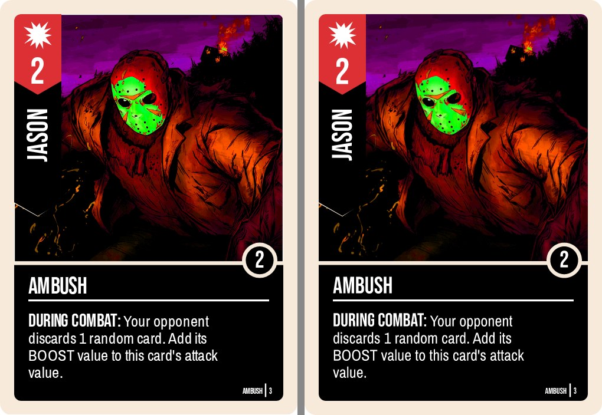
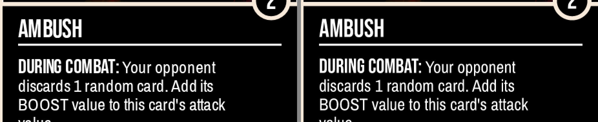
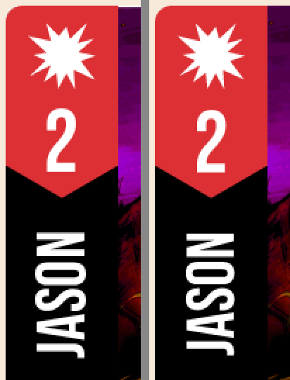
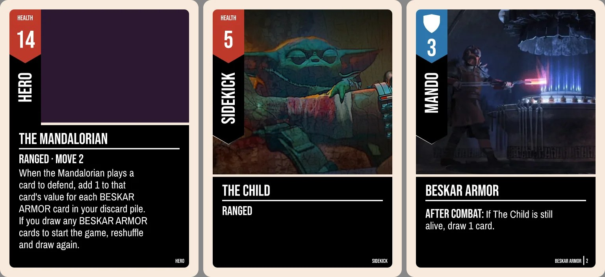
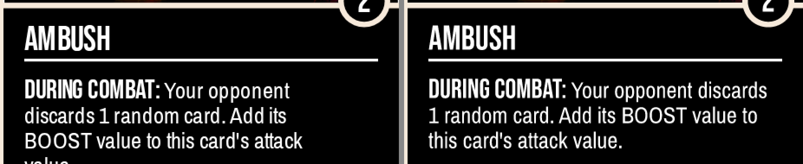

# Card faces on demand for any unmatched.cards deck (D1)

Issue #1045 · tracker #1005 · status: **proposal, for Dean to decide**

## Recommendation

**Option 1: the server renders on demand, with no Chromium.** unbrewed-api fetches the deck from unmatched.cards itself. It lays each face out with the sandbox's own `CardSvg` and character-card components, measures text on a Skia canvas (`@napi-rs/canvas`), rasterises with `resvg`, and stores the webp in R2 under a content hash.

The prototype in `scripts/tableplace/face-prototype/` shows this is feasible:

- **Layout matches.** 391 of 392 faces across 28 real decks (action, hero, sidekick and rule cards) lay out identically to the sandbox in Chrome: same wraps, panel heights, canton shift and body size. The one miss is a card with an emoji (see Fidelity).
- **Pixels match closely.** A zoomed crop shows the same card. What differs is sub-pixel glyph spacing and art resampling, not layout (see the images below).
- **It's fast and small.** A whole deck renders cold in **3–5 s** (13–17 unique faces), and about 1 s of that is fetching art. It comes to **0.3–0.6 MB per deck**, at 15–42 KB per face.
- **It only needs prebuilt native npm packages** (`@resvg/resvg-js`, `@napi-rs/canvas`, `sharp`). All of them ship linux-x64-gnu binaries, so they fit unbrewed-api's stock Nixpacks Node image. There's no browser, no Dockerfile and no system libraries.

Option 2 (the browser renders and the server stores) runs into a hard wall: canvas taint. The art is hotlinked from hosts that don't send CORS headers, so the browser can't export its own render. Option 3 (a table.place template) gives up the look and needs a tableplace-side feature. Details are in the comparison below.

## Constraints (from the ticket, `api.table.place/llms.txt` §5)

- Faces must be public `https` URLs that are CORS-readable and hotlinkable.
- `data:` refs are refused, and the relay drops messages over 1 MiB, so nothing can be embedded.
- `localhost` is blocked by Chrome's local-network permission (#1035).
- No static images per deploy (#1007 was removed in #1044). Faces have to work for **any** unmatched.cards deck.

## What the prototype proved

Run it from `scripts/tableplace/face-prototype/` (`npm install` there too); each script's header gives its usage.

| Script | What it does |
|---|---|
| `render.mjs --deck DOPE --card AMBUSH` | Server path, one face. It fetches the deck from `unmatched.cards/api/decks/<id>`, lays out through `serverEntry.tsx` (the real components, bundled for Node by esbuild), fetches the art, rasterises with resvg and writes 504×704 webp. Prints timings for each stage. |
| `render.mjs --deck DOPE --all` | Every face of a deck, timed, keyed `<key>.<hash>.webp`. |
| `reference.mjs --deck DOPE --card AMBUSH` | Ground truth: the same card through the sandbox's real `Card` in headless Chromium, set up exactly like the removed #1007 script. Dev box only. |
| `reference.mjs --validate id,id,…` | Lays out every face of each deck in both Chrome and Node and reports any difference. |
| `compare.mjs sandbox.png server.png` | Pixel diff scored separately for frame+text and art, with side-by-side and zoomed crops and a heatmap. |

### One card, side by side

`DOPE` (Jason Voorhees, a real unmatched.cards deck), "Ambush". **Left: the sandbox's `Card` in Chromium. Right: the server path.**

Text panel at 2× zoom (left: sandbox, right: server):

Canton at 2× zoom:

Hero, sidekick and action card from `lDOM` (The Mandalorian), all server-rendered:

The numbers (`compare.mjs`, 0–255 per channel, composited on white):

| Region | Mean abs diff | Pixels Δ>16 | Pixels Δ>64 |
|---|---|---|---|
| Frame + text | 9.2 | 7.1% | 4.8% |
| Art window | 13.7 | 21.8% | 4.3% |

The heatmap (`media/tableplace-faces/ambush-diff.png`) is all edges. The glyphs sit a fraction of a pixel apart, and the art is framed about 1 px differently vertically: the best-aligned offset for the art is dy=−1, which drops its error from 7.9 to 5.7. Nothing is missing, moved or re-wrapped.

### What the server needs to get right

The prototype hit each of these. Every one is now handled in `render.mjs`:

1. **Chrome's canvas rounds glyph advances on Linux.** At the card's 3–6 px layout sizes, `measureText` returns whole-pixel advances per glyph, so 3.3 px body text measures about 24% wider than the font's metrics. The sandbox wraps on those numbers. The server reproduces this by summing `Math.round(advance)` per glyph, which matches Chrome exactly at card sizes (`--measure chrome-linux`, the default). With true fractional widths (`--measure exact`) the lines come out fuller and only 10 of 392 layouts match:

   

   ⚠️ **This means the sandbox's own wraps depend on the OS.** Chrome on macOS and Windows probably measures fractionally and so wraps like `exact`. I haven't verified that; there's no Mac here. The #1007 renders, and this prototype's reference, are Linux Chrome. **Decision for Dean: which wrap is canonical?** `chrome-linux` matches #1007 and what a Linux player sees. `exact` is typographically truer. It's a one-line switch either way.
2. **Card-type colours are global CSS, not SVG.** The red, blue and purple canton and boost circle come from `.attack` / `.defence` / `.versatile` / `.scheme` in `styles/globals.css`, so a string-rendered `CardSvg` comes out black. The server injects those rules as a `<style>` in the SVG.
3. **Font names.** The components style with the `@font-face` aliases (`BebasNeueRegular`, …). resvg matches on the family name inside the file (`Bebas Neue`, `Archivo Narrow`, `League Gothic`), so the SVG gets rewritten.
4. **Canvas whitespace.** A character name of `"KONG\n"` measures as `"KONG "` in Chrome, because canvas text preparation maps ASCII whitespace to a space. The emulation does the same, which took `kdKM` from 0 to 13 matching faces.
5. **Art URLs with stray whitespace** (`" https://i.imgur.com/…"`). A browser's URL parser trims them, but resvg treats them as unloadable, so they're trimmed first.
6. **Art is pre-scaled** with sharp (lanczos3, cover, centred, the same framing as `xMidYMid slice` and CSS `cover`) to exactly the pixels it fills, so resvg draws it 1:1. This also caps the decode cost of an oversized upload.
7. **Glyphs outside the card fonts** (emoji, non-Latin) fall back to whatever font the viewer's machine has. That's the one layout miss (`p1Ew` "Speed Blitz", `⚡️`). The server needs a pinned fallback set (Noto Sans and Noto Emoji) for both measuring and drawing. Exact parity with every viewer is impossible anyway, because a Mac draws Apple Color Emoji.

What stays different: Chrome also rounds glyph advances when it **draws** SVG text at the CSS size (the #1007 script's `LAYOUT_W` note), and resvg places glyphs exactly. So words sit up to about 1 px apart at 504 px wide, as the zoom shows. The sandbox itself differs this way between the hand (143 px wide) and the /bag grid (200 px), so there's no single pixel truth to hit. I'd accept this difference.

## The three options

### 1. Server renders on demand (recommended)

- **Where it runs:** a new route in unbrewed-api (Railway, Nixpacks, Node 22, plain `node:http`; routes are `isXPath` + `handleXRoutes` modules wired into `src/http/app.ts`, e.g. `src/http/replays.ts`). Optional dependencies already follow a pattern where `null` makes the route return 503 (`app.ts` ~57–62). Face storage would fit that pattern, so the route stays off until R2 is configured.
  - The card code has one owner: p2p. It would build a Node bundle of `CardSvg`, `character.card`, `faceJobs` and the measurer, as `serverEntry.tsx` does, plus the three OTFs. unbrewed-api would vendor that bundle through a sync script. There's precedent: `unbrewed-api/scripts/build-deck-manifest.ts` already builds from p2p's `public/evergreen-decks`. The bundle carries a `RENDER_VERSION`.
- **Storage: R2.** Reuse artgen's SDK-free client: `unbrewed-artgen/packages/api/src/media/sigv4.ts` + `r2.ts` (`R2MediaStore.put`, `urlFor`: `public/…` keys resolve to `${R2_PUBLIC_BASE}/${key}`). Use a **separate bucket and write-scoped token** (artgen's token is scoped to its own bucket by design, `docs/05-architecture.md` ~321), behind a custom domain, e.g. `faces.unbrewed.xyz`. Set bucket CORS to `GET *`.
  - **Not a Railway volume:** it would serve every hotlinked face through the API process, with no CDN and billed egress, and it wouldn't survive a service move. unbrewed-api has no storage today, only Postgres (agent recon: no S3/R2/volume env vars).
- **Cost per deck** (measured 13–17 faces at about 35 KB, so ≤0.6 MB; list prices, worth rechecking):
  - R2 storage: 0.6 MB × $0.015/GB-month ≈ **$0.00001/month**.
  - Writes: about 15 class-A operations × $4.50/M ≈ **$0.00007**, once per unique deck version.
  - Reads: egress is free, and class B is $0.36/M. A table loads about 30 faces, roughly $0.00001.
  - Railway CPU: about 3 s of one vCPU (~$20/vCPU-month) ≈ **$0.00003**.
  - R2's free tier (10 GB, 1M class A/month) covers well over 10 000 deck renders a month.
- **Cache and invalidation:** content-addressed, so there's no invalidation step. The key is `faces/<RENDER_VERSION>/<sha256(kind, face fields, art url, measure mode)>.webp`, with `Cache-Control: public, max-age=31536000, immutable`.
  - Editing a deck changes the face fields, so it gets a new key. Unchanged cards keep their key and **dedupe across every player and deck**.
  - A template change bumps `RENDER_VERSION`, so every face re-renders lazily on next use.
  - Old keys can go under an R2 lifecycle rule, for example "delete if not re-put in 180 days". Or skip it: 10 000 decks is about 6 GB, which is still free tier.
  - ⚠️ **Don't use today's `faceFingerprint` as the global key.** It's 32-bit FNV-1a, which is fine inside one deck. As a global content address, by the birthday bound, 100 000 faces gives roughly a 69% chance that two different cards share a key and one silently shows the other's face. Use SHA-256 (hex, 128 bits is enough).
  - The fingerprint also misses two inputs a face draws: a hero or sidekick face's art can come from **another card's** `imageUrl` (`characterArt`), and the cosmetic `rimTier`. Hash what the renderer actually reads.
- **Abuse and rate limits:** the client sends only `{ deckId, versionId? }`. Content comes from unmatched.cards, and there are no uploads. What remains:
  - **SSRF through art URLs.** They're user-authored, and the server fetches them. Allow `https` only, resolve DNS and refuse private, loopback and link-local addresses, follow no redirects (or re-check each hop), and set a 10 s timeout, a size cap of about 10 MB, an `image/*` content type and sharp `limitInputPixels`. A dead or refused URL renders the frame with no art, as the sandbox does.
  - **Deck fetch:** reuse artgen's hardened importer (`packages/api/src/guidance/deckImport.ts`: `redirect: 'error'`, 12 s timeout, 1 MB cap, 5 min cache) and its link parser (`packages/core/src/deckImport.ts` `parseDeckLink`).
  - **CPU:** a `TABLEPLACE_FACES` limit on the existing `KeyedRateLimiter` (`src/http/rateLimit.ts`), for example 6 cold renders per IP per 10 min. Add a global render concurrency of 1–2 and in-flight coalescing per `deckId@version`, so two players creating at once cause one render. Cap faces per deck (for example 80).
  - **Content:** we host whatever text and art a public unmatched.cards deck has, under our domain. That's the same exposure the sandbox already has, and nothing new is uploadable.
- **Time from "Create table" to URLs:** about 1 s when warm (every key exists: fetch the deck, hash, then HEAD or a Postgres lookup). **3–5 s cold** for a new deck, measured on 4 cores, rendering serially with art fetched in parallel. A worker pool over `resvg`/`sharp` would bring the render part under 1 s if needed.
- **Fidelity:** the same components, fonts and layout as the sandbox. 391/392 layouts are identical, and the pixel differences are sub-pixel (see above).
- **Change to `/table`:** on "Create table", before the dry run, call `POST /tableplace/faces` for each seat whose deck is unmatched.cards-sourced. Build a `FullFaceResolver` from the reply, keyed by `faceJobs` key **and** checked against the hash p2p computes on its own copy. A bag deck that was edited locally, or saved before an unmatched.cards edit, then gets `null` for just the changed cards, and those take the existing "omitted with a note" path (#1047) instead of showing a stale face. Show a "Preparing card faces…" state for the 3–5 s.
  - Decks that already have faces (Labs, the-unmatched.club, full-art) keep passing straight through.

### 2. Browser renders, server stores

- **Where it runs:** `/table` mounts the real `Card` and draws it to a canvas (SVG → `drawImage` → `toBlob`), then uploads each webp to an API route that PUTs it to R2. Storage is the same as option 1.
- **Blocker: canvas taint.** The art is hotlinked from `i.ibb.co`, `i.imgur.com`, wikia and so on. When a host doesn't send `Access-Control-Allow-Origin`, drawing it taints the canvas and `toBlob` throws. The only fix is to proxy the art through our server, which means the server fetches every art URL anyway (the SSRF work of option 1) and still has to trust the client's pixels. The DOM-hybrid `Card` (HTML art layer plus SVG frame) also can't go to a canvas directly; it would need the all-SVG `CardSvg` path, which is what option 1 renders anyway.
- **Cost per deck:** the same storage, with no server CPU. Upload is 0.3–0.6 MB per cold deck from the player's connection.
- **Cache:** the same content keys. The server can't compute a key it trusts without the deck, so either the client's hash is believed (poisonable: upload anything under a popular card's key) or the server fetches the deck to check hashes, which is half of option 1.
- **Abuse:** this is the real problem. It's an image-upload endpoint on our domain. Validating that an upload "is this card" means rendering it server-side and comparing, which is option 1 plus extra steps. Without that, anyone can host arbitrary images on `faces.unbrewed.xyz`, and a poisoned shared key corrupts other players' tables.
- **Time to URLs:** render (about 50 ms per face in-browser) plus the upload. Similar to option 1 cold, faster on a slow server, slower on a slow connection.
- **Fidelity:** the viewer's own Chrome, so the sandbox by definition, but it varies by OS. Two players could produce different faces for the same key.
- **Change to `/table`:** a hidden render stage and an upload progress UI. It's the most client code of the three.

### 3. table.place learns a card template (`gen:unbrewed/<json>`)

- **Where it runs:** in table.place's client. We host nothing.
- **Blockers:**
  - It's a tableplace-side feature: someone else's roadmap, and the face ref has to fit the 1 MiB relay budget alongside every other card.
  - The card looks like **their** version of our template (their fonts, their wrap), so it drifts from the sandbox, and every template change is a coordinated release.
  - The art still has to be hotlinked into WebGL textures, which needs CORS on the art hosts. The ones above mostly don't send it, so table.place would need its own image proxy anyway.
- **Cost:** zero for us. **Cache:** theirs. **Abuse:** theirs; arbitrary text rendered in their client. **Time to URLs:** instant.
- **Fidelity:** lowest. **Change to `/table`:** a new resolver that emits `gen:` refs, the smallest p2p change, but gated on another team.

### Side by side

| | 1. Server renders | 2. Browser renders, server stores | 3. table.place template |
|---|---|---|---|
| Runs | unbrewed-api (Railway) | player's browser + upload route | table.place client |
| Storage | R2, content-keyed | R2, content-keyed | none |
| Cost per cold deck | ≈ $0.0001 | ≈ $0.0001 (no CPU) | $0 |
| Warm / cold to URLs | ~1 s / 3–5 s | ~1 s / render + upload | instant |
| Arbitrary uploads | **none** | **yes** (moderation surface) | n/a |
| Art-host CORS | irrelevant (baked in) | **blocks export** (canvas taint) | **needed** for textures |
| Fidelity to sandbox | same components; 391/392 layouts identical | the viewer's own render (varies by OS) | re-implementation |
| Who builds | us (api + p2p resolver) | us (most client code) | table.place |

## Proposed build tickets (for the orchestrator)

1. **p2p: `lib/tableplace/faceRender/`**: promote `serverEntry.tsx` plus the measurer into a Node-safe module. Output is an SVG string per `FaceJob`, with card-type CSS, the font-name rewrite and href trimming built in. Add a build that emits `face-renderer.mjs` + fonts + `RENDER_VERSION`. Add jest tests that pin layouts for a few fixture decks (as `--validate` does).
   - Fix the hash: SHA-256 over everything the face reads, including the character-art pick and the rim tier.
   - Settle the `chrome-linux` vs `exact` decision first.
2. **api: R2 face store**: vendor artgen's `sigv4.ts` / `r2.ts`, add `FACES_R2_*` env and a new bucket on a custom domain with `GET *` CORS. Keep the route off (503) until configured.
3. **api: `POST /tableplace/faces`**:
   - Request `{ deckId, versionId? }`; response `{ renderVersion, faces: { [key]: { hash, url } }, skipped }`.
   - Deck fetch reuses artgen's importer.
   - Art fetch is SSRF-safe with size caps; add a pinned Noto fallback font.
   - Rate limit, global concurrency 1–2, in-flight coalescing, face cap.
   - Tests use a fake S3 (artgen `packages/api/test/fakeS3.ts`).
4. **p2p: `serverFaces` resolver + `/table`**: call the route for unmatched.cards decks, hash-checked resolver, a "Preparing card faces…" state, and fall back to the #1047 omitted-with-note path.

## Open questions for Dean

1. **Canonical wrap:** `chrome-linux` (matches #1007 and Linux players) or `exact` (fuller lines, probably what Mac and Windows show)?
2. **Bag decks not from unmatched.cards** (hand-made JSON): leave them unsupported in v1, or accept the deck **JSON** in the POST body later? That would still be text plus art URLs with no uploads, but it would let anyone put arbitrary text on an image under our domain.
3. **Bucket domain:** `faces.unbrewed.xyz` on a new bucket, or a prefix in artgen's bucket? A new bucket keeps the tokens separate.
